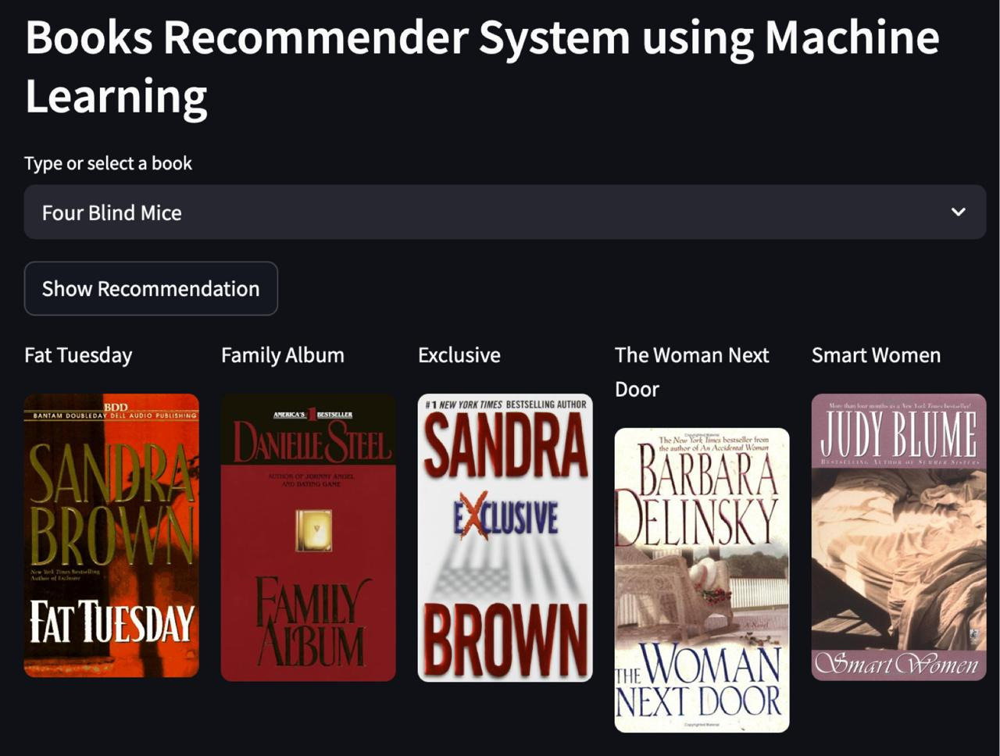

# Project: Book Recommender System Using Machine Learning | Collaborative Filtering Based

 

Recommendation systems have become increasingly vital in today’s fast-paced world, where people are constantly pressed for time due to numerous responsibilities. These systems help users make informed decisions quickly, reducing the mental effort required to evaluate countless options.

At their core, recommendation systems aim to identify and suggest content that aligns with an individual's interests. They rely on multiple factors to generate personalized lists of valuable and relevant items tailored to each user. These systems utilize artificial intelligence algorithms to sift through vast amounts of data and produce customized recommendations. The suggestions are typically influenced by a user's profile, browsing or search history, the preferences of similar users, and the likelihood of engagement with certain items. This personalization is made possible through techniques like predictive modeling and heuristic analysis of available data.


# Types of Recommendation System :

### 1) Content Based :

Content-based recommendation systems rely on the attributes and features of items to generate personalized suggestions. These systems analyze user preferences by examining the characteristics of content they have previously interacted with and then recommend similar items. For instance, platforms like Twitter and YouTube use this approach by tracking what music a user listens to or which artists they follow, forming feature embeddings to represent this behavior. The system then constructs a user-specific vector that helps identify content with comparable features. The underlying assumption is that if a user liked certain content in the past, they will likely enjoy similar content in the future. However, one limitation of content-based filtering is that it can lead to over-specialization. This means the system may continue recommending only a narrow range of items, potentially missing out on suggesting content outside the user’s usual preferences, even if those could be of interest.


### 2) Collaborative Based :
		
Collaborative filtering systems generate recommendations by analyzing user-item interactions, focusing primarily on user behavior rather than item attributes. These systems identify patterns by clustering users who have shown similar preferences, such as giving comparable ratings. For example, in a book recommendation scenario, collaborative filtering might group users with similar reading habits and use those clusters to suggest new titles. Typically, the system relies on a single parameter like user ratings or comments to assess preferences. The core principle behind collaborative filtering is that if User A likes a particular item and User B also likes that same item along with another one, then User A is likely to enjoy the second item as well.
	
- Issues are :

	- User-Item nXn matrix , so computationally expensive .

	- Only famous items will get reccomended .

	- New items might not get reccomended at all .   

### 3) Hybrid Based :

Hybrid recommendation systems combine both content-based and collaborative filtering approaches to overcome the limitations of relying solely on one method. By integrating information about item features and user behavior, these systems can provide more accurate and diverse recommendations. This combination helps avoid issues such as over-specialization in content-based systems or data sparsity in collaborative filtering. Hybrid models are widely used today across many platforms and often incorporate advanced techniques like word2vec and feature embeddings to enhance the quality of suggestions.
          

# About this project:

This is a streamlit web application that can recommend various kinds of similar books based on a user interest.
here is a demo,

* [Click here to run it live on server](https://book-recommendation-6c70d4b31486.herokuapp.com/)


# Demo:





# Dataset has been used:

* [Dataset link](https://www.kaggle.com/ra4u12/bookrecommendation)

# Concept used to build the model.pkl file : NearestNeighbors

1 . Load the data
	
2 . Initialise the value of k

3 . For getting the predicted class, iterate from 1 to total number of training data points

4 . Calculate the distance between test data and each row of training data. Here we will use Euclidean distance as our distance metric since it’s the most popular method. 

5 . Sort the calculated distances in ascending order based on distance values
	
6 . Get top k rows from the sorted array

# How to run?
### STEPS:

Clone the repository

```bash
https://github.com/zooviee/book-recommender-system
```
### STEP 01- Create a conda environment after opening the repository

```bash
conda create -n books python=3.12 -y
```

```bash
conda activate books
```


### STEP 02- install the requirements
```bash
pip install -r requirements.txt
```


```bash
#run this file to generate the models

Book_Recommender.ipynb
```

Now run,
```bash
streamlit run app.py
```


```bash
Author: Oluwaseyi Akinsanya
Data Scientist
Email: seyiakinsanya1999@gmail.com

```


